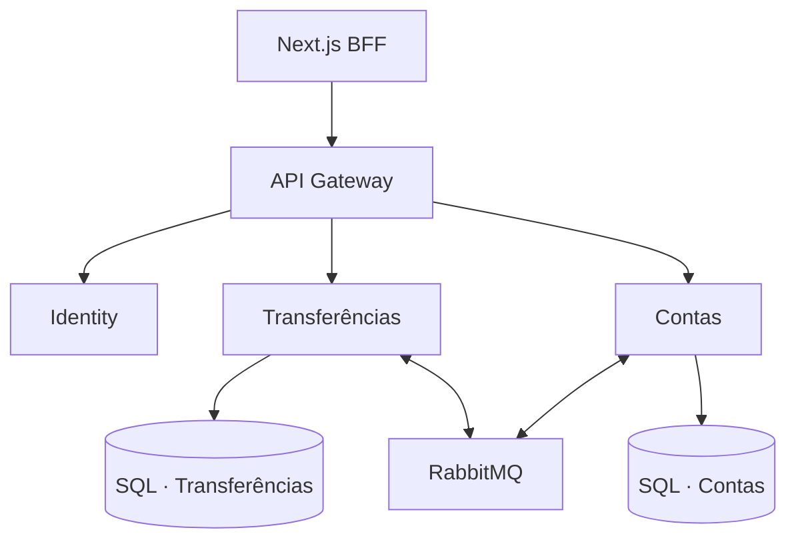
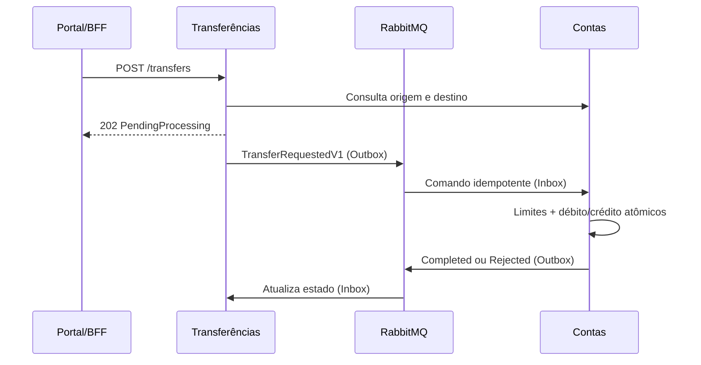

# BankFlow

Laboratório autoral de core banking que demonstra contas digitais, Pix e transferências internas, limites de segurança, razão contábil, estornos e engenharia de produção em uma arquitetura distribuída.

> **Aviso:** projeto educacional e de portfólio. Todas as transações e identidades são simuladas; não há dinheiro real. BankFlow não é afiliado, patrocinado nem endossado pelo Nubank ou por qualquer instituição financeira. A interface e as regras foram criadas de forma independente com base em conceitos públicos do setor.

## O que este projeto prova

- modelagem de domínio com invariantes financeiras;
- débito e crédito atômicos e lançamentos imutáveis;
- idempotência por referência externa;
- integração assíncrona com RabbitMQ;
- Outbox/Inbox e entrega pelo menos uma vez;
- compensação por estorno sem apagar o histórico original;
- limites diário e noturno avaliados na liquidação;
- concorrência otimista com `rowversion`;
- JWT, BFF com cookie `HttpOnly`, rate limiting e headers de segurança;
- health checks, OpenTelemetry, Aspire Dashboard, Docker e Kubernetes;
- portal responsivo em Next.js 16 com identidade visual própria.

## Arquitetura



Cada domínio possui camadas `Domain`, `Application`, `Infrastructure` e `Api`. O serviço de Transferências nunca altera saldo diretamente; Contas é a única fonte de verdade financeira.

## Fluxo de uma transferência



O resultado definitivo é assíncrono. O portal faz atualização automática enquanto houver transferências pendentes.

## Regras de negócio principais

### Contas

- conta nasce ativa, com número e chave Pix únicos;
- CPF/CNPJ é armazenado normalizado e devolvido mascarado pela API;
- saldo nunca pode ficar negativo;
- conta bloqueada não envia, mas pode receber;
- conta encerrada não envia nem recebe e não pode ser reativada;
- encerramento só é permitido com saldo zero;
- limite noturno não pode superar o limite diário;
- valores possuem no máximo duas casas decimais;
- aportes existem apenas para facilitar a demonstração e geram lançamento auditável.

### Transferências

- origem e destino devem ser diferentes e existentes;
- valor permitido: R$ 0,01 a R$ 50.000.000,00;
- métodos demonstrados: `Pix`, `Internal` e `Ted`;
- uma referência externa repetida com o mesmo conteúdo devolve a operação existente;
- a mesma referência com conteúdo diferente retorna conflito;
- a consulta síncrona melhora a experiência, mas Contas revalida saldo, estado e limites no momento da liquidação;
- período noturno demonstrativo: 20h às 6h em UTC−3, considerando o valor acumulado na janela;
- transferências concluídas contam para o limite diário; estornos não restauram esse limite;
- rejeições registram um motivo explícito, sem movimentar saldo.

### Estornos

- somente transferências concluídas podem ser estornadas;
- o lançamento original nunca é alterado ou apagado;
- o estorno cria um débito compensatório no destinatário e um crédito na origem;
- o estorno é rejeitado se o destinatário não estiver ativo ou não possuir saldo;
- solicitações e resultados também usam Outbox/Inbox.

Detalhes e cenários estão em [docs/specification/business-rules.md](docs/specification/business-rules.md).

## Tecnologias

| Área | Tecnologia |
|---|---|
| Backend | .NET 10, C# 14, Minimal APIs |
| Frontend | Next.js 16.3, React 19, TypeScript |
| Persistência | SQL Server 2022, EF Core 10 |
| Mensageria | RabbitMQ 4, Topic Exchange, DLQ |
| Segurança | JWT, PBKDF2, BFF, HttpOnly, SameSite, CSP, rate limiting |
| Observabilidade | OpenTelemetry, OTLP, Aspire Dashboard |
| Qualidade | xUnit, NetArchTest, ESLint, TypeScript, k6 |
| Operação | Docker Compose, GitHub Actions, Kubernetes/Kustomize |

## Execução local

Pré-requisitos: Docker Desktop com Linux containers e PowerShell 7 ou Windows PowerShell.

```powershell
Set-Location -LiteralPath "C:\caminho\BankFlow"
.\scripts\bootstrap.ps1 -Start
```

O script cria `.env` com segredos aleatórios, constrói as imagens e inicia a plataforma.

| Recurso | Endereço |
|---|---|
| Portal | http://localhost:3000 |
| Gateway | http://localhost:8080 |
| Identity | http://localhost:8081 |
| Transferências | http://localhost:8082 |
| Contas | http://localhost:8083 |
| Aspire | http://localhost:18888 |
| RabbitMQ | http://localhost:15672 |

Credencial demonstrativa:

```text
E-mail: admin@bankflow.local
Senha: BankFlow#2026
```

Nunca reutilize essa credencial em um ambiente real.

## Demonstração sugerida

1. Entre no portal e mostre os quatro serviços operacionais.
2. Abra **Contas**, consulte as três contas semeadas e seus limites.
3. Crie uma conta ou faça um aporte simulado; abra o extrato.
4. Em **Transferências**, envie um Pix entre duas contas.
5. Mostre `PendingProcessing` mudando automaticamente para `Completed`.
6. Abra os extratos de origem e destino e mostre o par débito/crédito.
7. Solicite um estorno e mostre os lançamentos compensatórios.
8. Demonstre uma rejeição por saldo ou limite.
9. Abra **Observabilidade**, Aspire e RabbitMQ.

## Validação

No Windows com .NET 10 e Node 22:

```powershell
dotnet restore BankFlow.slnx
dotnet build BankFlow.slnx --configuration Release --no-restore
dotnet test --solution BankFlow.slnx --configuration Release --no-build

Set-Location src/Web/bankflow-web
npm ci
npm run lint
npm run build
```

Teste funcional com a plataforma ativa:

```powershell
.\scripts\test-bankflow.ps1
```

Teste de carga:

```powershell
docker compose --profile load run --rm load-test
```

## Decisões e limites conscientes

- SQL Server por serviço preserva ownership de dados, mas aumenta o custo operacional.
- consistência eventual mantém baixo acoplamento, mas exige estados intermediários na UX.
- `EnsureCreatedAsync` simplifica o laboratório Docker; uma evolução de produção deve usar migrations versionadas e aprovação de schema.
- o Identity usa usuários configurados para demonstração; produção exige provedor de identidade, MFA, rotação e revogação.
- limites são uma política demonstrativa. Um banco real adicionaria motor antifraude, análise de dispositivo, compliance, KYC/AML, contestação, MED, limites por canal e aprovação em múltiplas etapas.
- o projeto permanece em .NET para aproveitar a base arquitetural; uma evolução alinhada a um ecossistema Clojure/JVM pode substituir serviços gradualmente por contratos/eventos, sem reescrever o portal.

Consulte [docs/architecture/containers.md](docs/architecture/containers.md), [docs/adr](docs/adr) e [docs/operations/runbook.md](docs/operations/runbook.md).

## Referências públicas de inspiração

- [Pix no Nubank](https://nubank.com.br/nu/conta/pix) — experiência pública de transferências e controle de limites;
- [Central de Proteção](https://nubank.com.br/ajuda-e-seguranca/central-de-protecao) — limites diurno/noturno e camadas de proteção;
- [Working with Clojure at Nubank](https://building.nubank.com/working-with-clojure-at-nubank/) — princípios públicos de microserviços, programação funcional, cloud e Kubernetes.

Essas fontes orientam o contexto do portfólio, não uma tentativa de reproduzir sistemas, código ou políticas internas.

## Uso responsável

Este repositório não implementa uma instituição financeira real, não atende requisitos regulatórios completos e não deve custodiar dados pessoais ou valores. Os documentos, CPFs, chaves e saldos incluídos são fictícios.

## Licença

MIT. Antes de publicar, revise credenciais, URLs e dados de demonstração.
