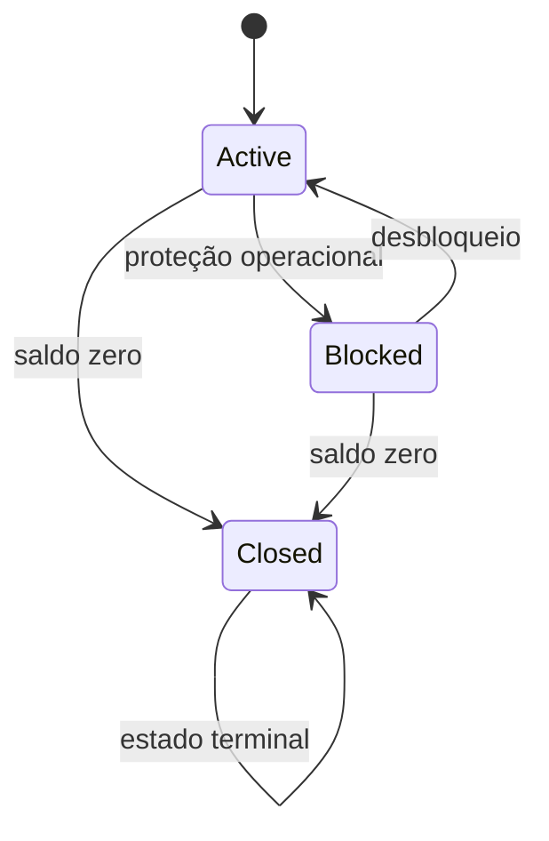
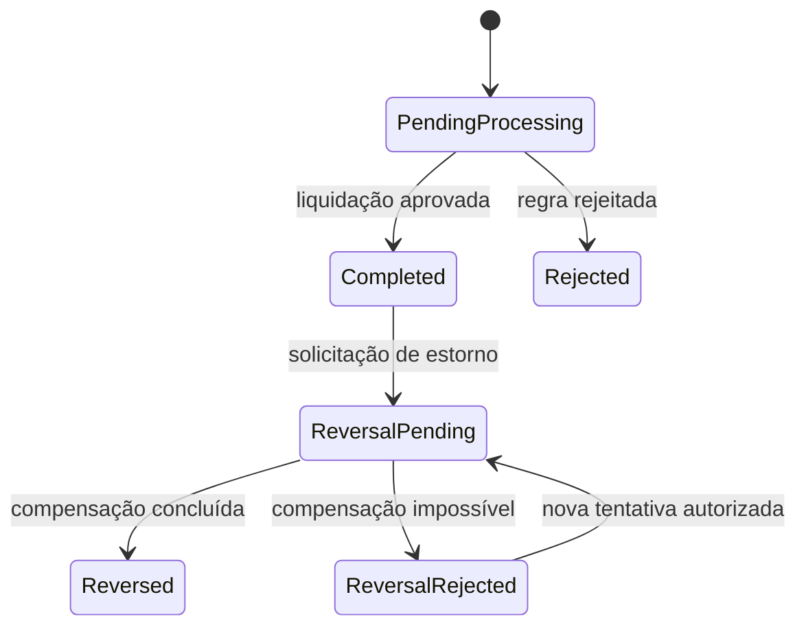

# Regras de negócio

## Escopo

BankFlow é uma simulação educacional. As regras abaixo são explícitas e testáveis, mas não representam políticas internas de nenhuma instituição.

## Máquina de estados da conta

| Estado | Recebe | Transfere | Reativa |
|---|---:|---:|---:|
| Active | Sim | Sim | — |
| Blocked | Sim | Não | Sim |
| Closed | Não | Não | Não |

## Máquina de estados da transferência

## Validação em duas etapas

1. Transferências consulta Contas sincronamente para oferecer erro rápido.
2. Contas repete todas as validações ao consumir o evento; essa decisão é autoritativa.

Isso protege contra saldo ou situação alterados no intervalo entre a consulta e a liquidação.

## Limites

- a janela diária começa à meia-noite em UTC−3;
- lançamentos `TransferDebit` concluídos entram no consumo diário;
- no período 20h–6h, a soma das transferências da janela deve respeitar `NightlyTransferLimit`;
- o limite noturno precisa ser menor ou igual ao diário;
- estornos não restauram limite consumido;
- aportes não consomem limite.

## Razão contábil

- o saldo da conta é atualizado na mesma transação SQL dos lançamentos;
- cada transferência cria exatamente um `TransferDebit` e um `TransferCredit`;
- o índice único `(TransferId, Type)` bloqueia duplicidade;
- o estorno cria `ReversalDebit` e `ReversalCredit`;
- lançamentos não possuem operação de edição ou exclusão pela API;
- `BalanceAfter` facilita auditoria e reconciliação.

## Idempotência e entrega

- a referência externa é única em Transferências;
- a Outbox é gravada na mesma transação da transferência;
- mensagens possuem `MessageId` estável;
- a Inbox impede reprocessamento do mesmo evento;
- filas possuem dead-letter queue;
- falha transitória recebe uma nova tentativa antes de seguir para DLQ.

## Motivos de rejeição

`AccountNotFound`, `AccountBlocked`, `AccountClosed`, `InsufficientFunds`, `DailyLimitExceeded`, `NightlyLimitExceeded`, `InvalidDestination`, `SettlementNotFound` e `AlreadyReversed`.

## Evoluções para produção

- KYC/AML e sanctions screening;
- motor antifraude por dispositivo e comportamento;
- autenticação forte e confirmação transacional;
- políticas configuráveis e versionadas por cliente/canal;
- aprovação assíncrona de aumento de limite;
- suporte a Pix real, DICT, SPI, MED e reconciliação;
- criptografia de PII em nível de aplicação e tokenização;
- ledger dedicado com reconciliação, fechamento e prova de invariantes;
- migrations online, feature flags e rollout progressivo.
